# 系统配置调整设计 - GPUStack模型服务集成

## 概述

本设计文档描述了如何将WeKnora系统的模型服务从默认配置调整为用户自己部署的GPUStack服务。调整涉及大语言模型、嵌入模型和重排序模型的配置，确保系统能够正确使用用户指定的模型服务。

## 目标需求

- **目标服务地址**: http://182.150.53.174:8299/v1/chat/completions
- **API密钥**: gpustack_b6070f918c567789_afcdc50334379ffc928c3e36a6f3a12c
- **大语言模型**: deepseek-r1-0528-qwen3-8b
- **嵌入模型**: qwen3-embedding
- **重排序模型**: bge-reranker-v2-m3

## 当前系统架构

### 模型集成架构

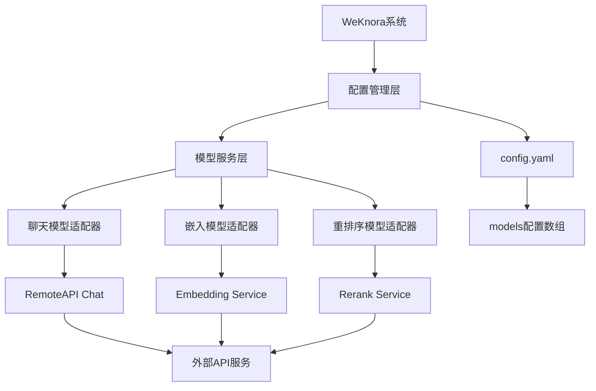

### 配置结构分析

根据现有代码分析，WeKnora使用以下配置结构：

```yaml
models:
  - type: "chat"           # 模型类型：chat, embedding, rerank
    source: "openai"       # 模型来源：openai, ollama等
    model_name: "模型名称"
    parameters:
      base_url: "API基础URL"
      api_key: "API密钥"
```

## 配置调整方案

### 新模型配置结构

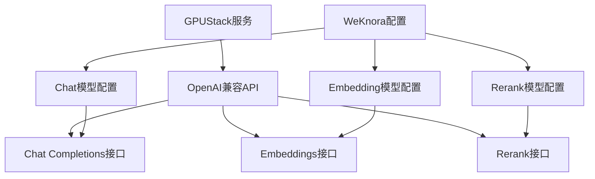

### 具体配置参数

#### 大语言模型配置
```yaml
models:
  - type: "chat"
    source: "openai"
    model_name: "deepseek-r1-0528-qwen3-8b"
    parameters:
      base_url: "http://182.150.53.174:8299/v1"
      api_key: "gpustack_b6070f918c567789_afcdc50334379ffc928c3e36a6f3a12c"
      temperature: 0.7
      max_tokens: 2048
```

#### 嵌入模型配置
```yaml
  - type: "embedding"
    source: "openai"
    model_name: "qwen3-embedding"
    parameters:
      base_url: "http://182.150.53.174:8299/v1"
      api_key: "gpustack_b6070f918c567789_afcdc50334379ffc928c3e36a6f3a12c"
      dimensions: 1024
```

#### 重排序模型配置
```yaml
  - type: "rerank"
    source: "openai"
    model_name: "bge-reranker-v2-m3"
    parameters:
      base_url: "http://182.150.53.174:8299/v1"
      api_key: "gpustack_b6070f918c567789_afcdc50334379ffc928c3e36a6f3a12c"
      top_k: 10
```

## 配置文件调整

### config.yaml完整模型配置

需要在现有的config.yaml文件中添加models配置节，完整配置如下：

```yaml
# 现有配置保持不变...

# 模型服务配置
models:
  # 大语言模型配置
  - type: "chat"
    source: "openai"
    model_name: "deepseek-r1-0528-qwen3-8b"
    parameters:
      base_url: "http://182.150.53.174:8299/v1"
      api_key: "gpustack_b6070f918c567789_afcdc50334379ffc928c3e36a6f3a12c"
      temperature: 0.7
      max_tokens: 2048
      top_p: 1.0
      frequency_penalty: 0.0
      presence_penalty: 0.0

  # 嵌入模型配置
  - type: "embedding"
    source: "openai"
    model_name: "qwen3-embedding"
    parameters:
      base_url: "http://182.150.53.174:8299/v1"
      api_key: "gpustack_b6070f918c567789_afcdc50334379ffc928c3e36a6f3a12c"
      dimensions: 1024
      encoding_format: "float"

  # 重排序模型配置
  - type: "rerank"
    source: "openai"
    model_name: "bge-reranker-v2-m3"
    parameters:
      base_url: "http://182.150.53.174:8299/v1"
      api_key: "gpustack_b6070f918c567789_afcdc50334379ffc928c3e36a6f3a12c"
      top_k: 10
      return_documents: true
```

## 技术实现细节

### 模型服务初始化流程

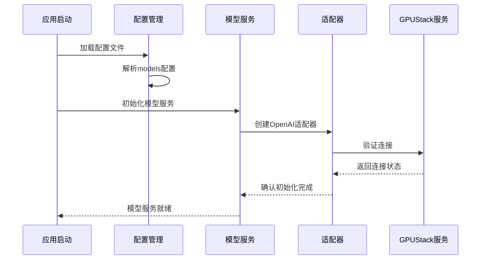

### 模型调用流程

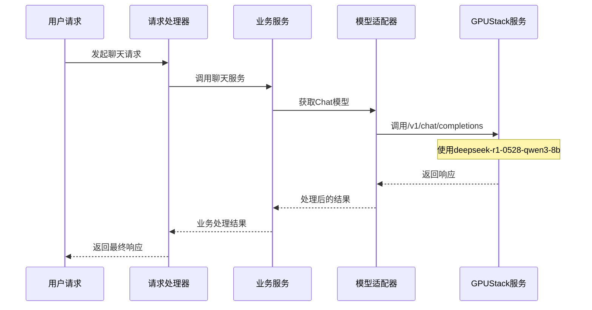

## 配置验证策略

### 连接测试机制

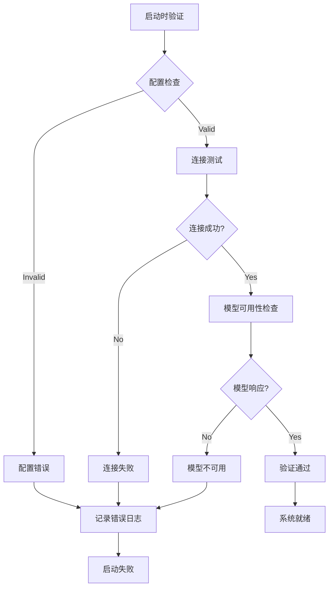

### 验证测试用例

| 验证项目 | 测试方法 | 预期结果 |
|---------|----------|----------|
| API连接 | HTTP健康检查 | 200状态码 |
| 认证验证 | 带token的请求 | 成功认证 |
| Chat模型 | 简单对话测试 | 正常回复 |
| Embedding | 文本向量化 | 返回向量数组 |
| Rerank | 重排序测试 | 排序结果 |

## 环境变量支持

为了增强安全性，支持通过环境变量配置敏感信息：

```yaml
models:
  - type: "chat"
    source: "openai"
    model_name: "deepseek-r1-0528-qwen3-8b"
    parameters:
      base_url: "${GPUSTACK_BASE_URL}"
      api_key: "${GPUSTACK_API_KEY}"
```

对应的环境变量：
```bash
export GPUSTACK_BASE_URL="http://182.150.53.174:8299/v1"
export GPUSTACK_API_KEY="gpustack_b6070f918c567789_afcdc50334379ffc928c3e36a6f3a12c"
```

## 降级和容错策略

### 服务降级机制

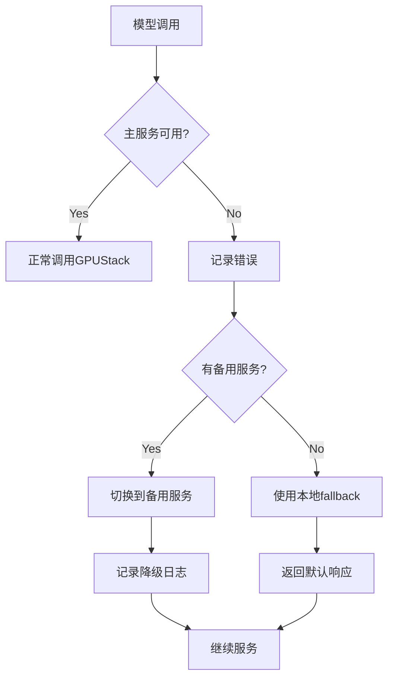

### 配置回退选项

```yaml
conversation:
  fallback_strategy: "fixed"
  fallback_response: "抱歉，模型服务暂时不可用，请稍后重试。"
```

## 监控和日志

### 关键监控指标

| 指标类型 | 监控内容 | 告警阈值 |
|---------|----------|----------|
| 可用性 | 服务响应时间 | >5秒 |
| 错误率 | API调用失败率 | >5% |
| 性能 | 模型推理延迟 | >10秒 |
| 配额 | API调用次数 | 接近限制 |

### 日志记录策略

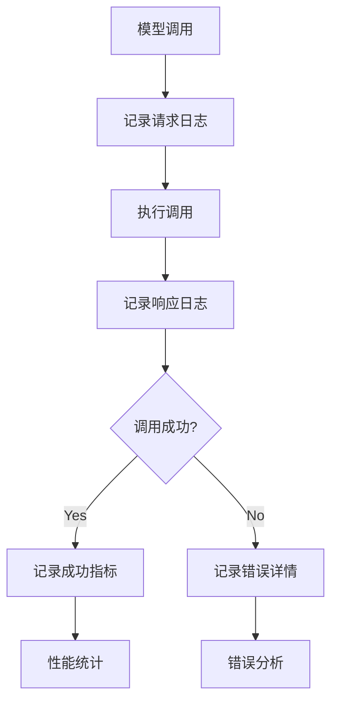

## 配置迁移步骤

### 实施计划

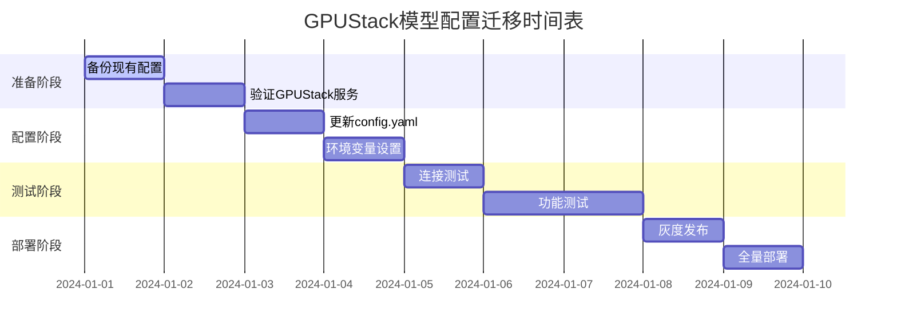

### 回滚计划

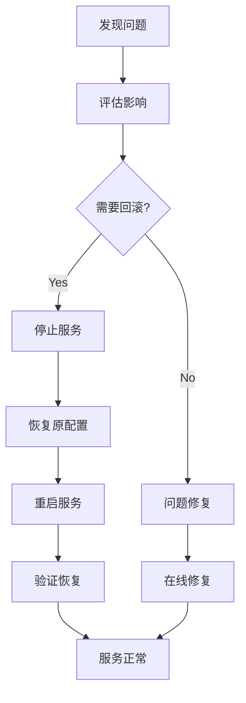

## 性能优化考虑

### 连接池配置

```yaml
models:
  - type: "chat"
    parameters:
      # 连接池配置
      max_idle_conns: 10
      max_open_conns: 100
      conn_max_lifetime: "1h"
      timeout: "30s"
```

### 缓存策略

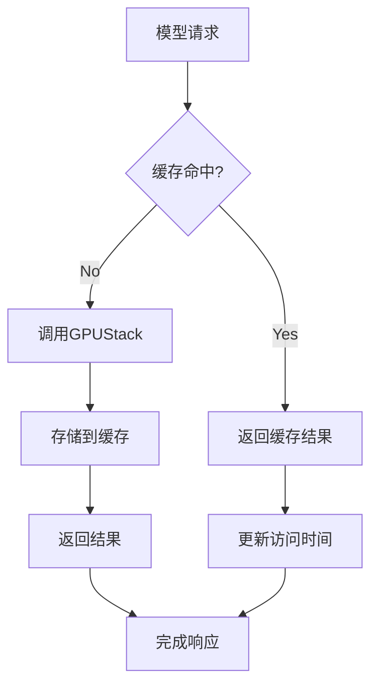

## 安全考虑

### API密钥安全

- 使用环境变量存储敏感信息
- 定期轮换API密钥
- 限制网络访问来源
- 启用HTTPS通信

### 网络安全

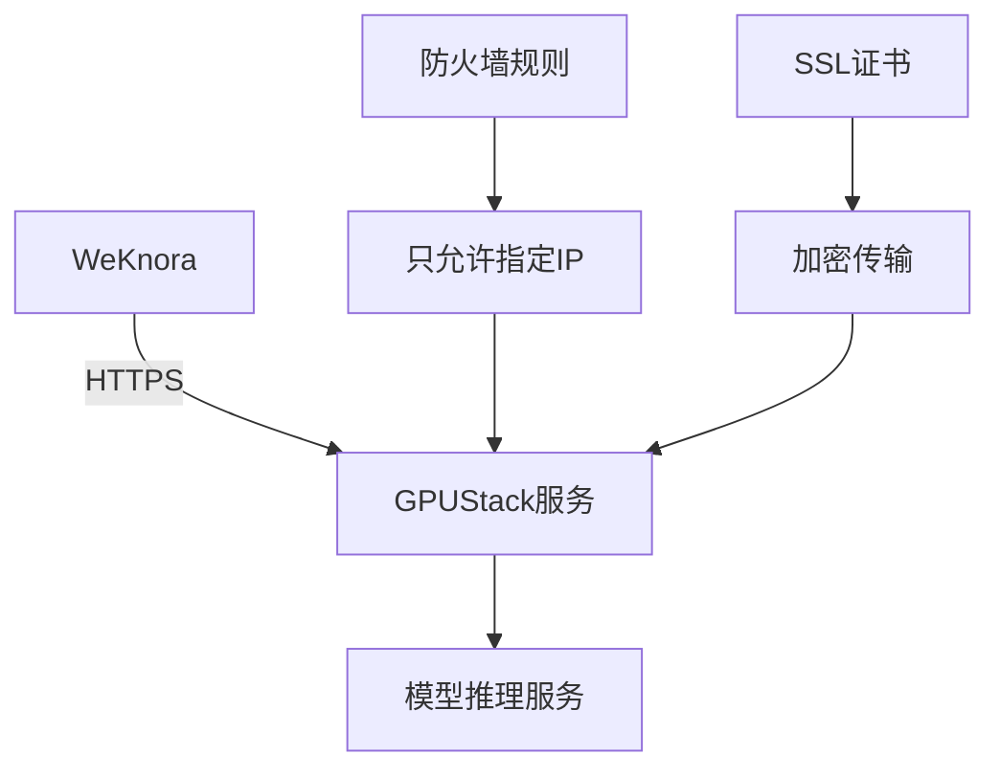

## 单元测试策略

### 测试覆盖范围

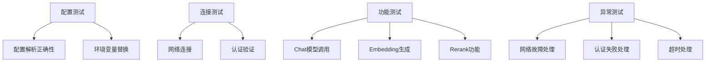

### 测试用例示例

| 测试场景 | 输入 | 预期输出 |
|---------|------|----------|
| 配置加载 | 有效的config.yaml | 成功加载模型配置 |
| API调用 | 标准聊天请求 | 正常返回响应 |
| 错误处理 | 无效的API密钥 | 抛出认证错误 |
| 超时处理 | 长时间无响应 | 超时异常 |