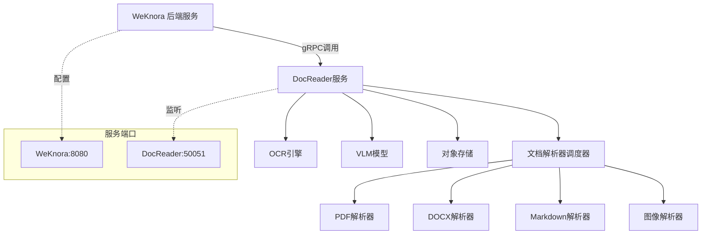

# WeKnora 文档解析服务故障排查与启动指南

## 概述

本文档详细说明了 WeKnora 系统中文档解析服务（docreader）的故障排查方法、启动流程和配置要求。当用户上传文档出现解析失败时，通常是由于 `services/docreader` 下的 Python gRPC 服务未正确启动造成的。

## 问题诊断

### 症状描述
- 文档上传后显示解析失败
- 知识库中文档状态为 `failed`
- 日志中出现 gRPC 连接失败错误

### 根本原因
1. **文档解析服务未启动**: `services/docreader` 中的 Python gRPC 服务未运行
2. **服务连接配置错误**: WeKnora 后端无法连接到 docreader 服务
3. **端口冲突或网络问题**: 默认端口 50051 被占用或不可访问
4. **依赖环境缺失**: Python 依赖包未正确安装

## 服务架构



## 启动检查清单

### 1. 环境依赖检查

**Python 环境**:
```bash
cd /Users/huoli4844/Documents/llm_project/WeKnora/services/docreader
python --version  # 需要 Python 3.8+
```

**依赖包安装**:
```bash
pip install -r requirements.txt
# 或使用 poetry
poetry install
```

### 2. 配置验证

**gRPC 端口配置**:
- 默认端口: `50051`
- 环境变量: `GRPC_PORT`
- 最大工作线程: `GRPC_MAX_WORKERS` (默认4)
- 工作进程数: `GRPC_WORKER_PROCESSES` (默认CPU核心数)

**OCR 后端配置**:
- 环境变量: `OCR_BACKEND` (默认"paddle")
- API URL: `OCR_API_BASE_URL`

### 3. 服务连接配置

**WeKnora 配置文件** (`config/config.yaml`):
```yaml
# 当前配置中缺失 docreader 配置段
# 需要添加以下配置:
docreader:
  addr: "localhost:50051"  # 或通过环境变量 DOCREADER_ADDR
```

**环境变量配置**:
```bash
export DOCREADER_ADDR="localhost:50051"
```

## 启动流程

### 方式一: 直接启动 Python 服务

```bash
cd /Users/huoli4844/Documents/llm_project/WeKnora/services/docreader
export PYTHONPATH="/app/src"
python src/server/server.py
```

### 方式二: 使用 Supervisord

```bash
cd /Users/huoli4844/Documents/llm_project/WeKnora/services/docreader
supervisord -c supervisord.conf
```

**Supervisord 配置** (`supervisord.conf`):
- 自动启动: `autostart=true`
- 自动重启: `autorestart=true`
- 日志文件: `/var/log/docreader.log`
- 环境变量: `PYTHONPATH="/app/src"`

### 方式三: 容器化启动

```bash
# 构建镜像 (如果需要)
cd /Users/huoli4844/Documents/llm_project/WeKnora/services/docreader
docker build -t weknora-docreader .

# 启动容器
docker run -p 50051:50051 weknora-docreader
```

## 故障排查步骤

### 1. 检查服务状态

**检查端口占用**:
```bash
lsof -i :50051
netstat -tlnp | grep 50051
```

**检查进程状态**:
```bash
ps aux | grep server.py
ps aux | grep supervisord
```

### 2. 测试服务连接

**本地 gRPC 连接测试**:
```bash
# 使用 grpcurl 测试 (需要安装)
grpcurl -plaintext localhost:50051 list

# 或使用 telnet 测试端口
telnet localhost 50051
```

**日志检查**:
```bash
# Supervisord 日志
tail -f /var/log/docreader.log

# 或直接查看 Python 服务输出
cd /Users/huoli4844/Documents/llm_project/WeKnora/services/docreader
python src/server/server.py
```

### 3. WeKnora 后端连接检查

**检查配置**:
```go
// 在 internal/container/container.go 中
func initDocReaderClient(cfg *config.Config) (*client.Client, error) {
    docReaderURL := os.Getenv("DOCREADER_ADDR")
    if docReaderURL == "" && cfg.DocReader != nil {
        docReaderURL = cfg.DocReader.Addr
    }
    return client.NewClient(docReaderURL)
}
```

**验证连接**:
- 检查 WeKnora 启动日志中的 docreader 连接信息
- 确认 `DOCREADER_ADDR` 环境变量或配置文件中的地址正确

### 4. 功能测试

**文档上传测试**:
1. 启动 docreader 服务
2. 启动 WeKnora 后端服务
3. 通过前端上传测试文档
4. 检查知识库中文档解析状态

## 服务配置优化

### 性能配置

**多进程模式**:
```bash
export GRPC_WORKER_PROCESSES=4  # 设置工作进程数
export GRPC_MAX_WORKERS=8       # 每进程最大线程数
```

**消息大小限制**:
- 最大消息长度: 50MB
- 支持大文件上传和处理

**并发控制**:
- OCR 处理使用信号量限制并发
- 异步图像处理避免阻塞

### 生产环境配置

**日志配置**:
```bash
# 设置日志级别
export LOG_LEVEL=INFO

# 日志轮转配置 (supervisord.conf)
stdout_logfile_maxbytes=50MB
stdout_logfile_backups=10
```

**监控配置**:
- 健康检查端点
- 进程状态监控
- 性能指标采集

## 常见问题解决

### 问题1: 端口已被占用
```bash
# 查找占用进程
lsof -i :50051
# 终止进程
kill -9 <PID>
# 或更换端口
export GRPC_PORT=50052
```

### 问题2: 依赖包缺失
```bash
# 重新安装依赖
pip install -r requirements.txt --force-reinstall
# 或检查特定包
pip show paddleocr python-docx beautifulsoup4
```

### 问题3: gRPC 连接超时
```bash
# 检查防火墙设置
sudo ufw status
# 检查网络连通性
telnet localhost 50051
```

### 问题4: OCR 服务不可用
```bash
# 检查 PaddleOCR 安装
python -c "import paddleocr; print('OCR OK')"
# 或设置备用 OCR 后端
export OCR_BACKEND=nanonets
export OCR_API_BASE_URL="your_api_url"
```

## 监控与维护

### 服务监控指标

**关键指标**:
- 服务可用性 (健康检查)
- 响应时间 (文档解析耗时)
- 错误率 (解析失败比例)
- 资源使用率 (CPU、内存)

**告警规则**:
- 服务下线告警
- 响应时间超过阈值
- 错误率超过 5%
- 内存使用率超过 80%

### 日常维护

**定期检查**:
- 检查日志文件大小和轮转
- 验证 OCR 服务功能
- 测试文档解析流程
- 更新依赖包安全版本

**备份策略**:
- 配置文件备份
- 日志文件归档
- 模型文件备份

## 快速启动命令

**一键启动脚本**:
```bash
#!/bin/bash
# 启动 docreader 服务
cd /Users/huoli4844/Documents/llm_project/WeKnora/services/docreader

# 设置环境变量
export PYTHONPATH="/app/src"
export GRPC_PORT=50051
export GRPC_MAX_WORKERS=4

# 启动服务
echo "Starting DocReader service..."
python src/server/server.py &

# 等待服务启动
sleep 5

# 测试连接
if lsof -i :50051 > /dev/null; then
    echo "DocReader service started successfully on port 50051"
else
    echo "Failed to start DocReader service"
    exit 1
fi
```

## 结论

文档解析服务是 WeKnora 系统的核心组件，负责将各种格式的文档转换为可搜索的文本块。正确启动和配置该服务对于确保文档上传和解析功能的正常运行至关重要。通过本文档提供的检查清单和故障排查步骤，可以快速定位和解决文档解析失败的问题。